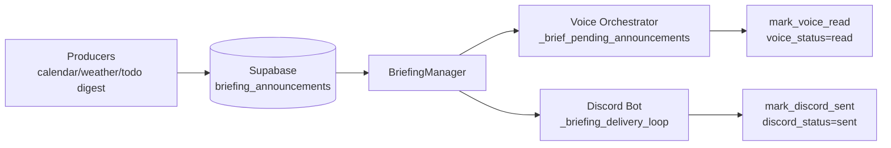

# Briefing System Dev README

Last verified against code on: 2026-04-18

This document describes the *current* briefing system implementation in HomeAssistV3 (not an idealized design), so we can safely plan major improvements.

## 1. What the briefing system is

A briefing is a proactive announcement row stored in `briefing_announcements` and delivered through one or both channels:
- Voice assistant (wake-word flow)
- Discord proactive briefing channel

The system is intentionally separate from user-driven task creation:
- User-driven reminders/tasks now belong in `todos`
- `briefing` tool is currently for inspection/dismissal of autonomous briefings

## 2. End-to-end architecture



Core components:
- Storage/query layer: `assistant_framework/utils/briefing/briefing_manager.py`
- Voice consumer: `assistant_framework/orchestrator.py`
- Discord consumer: `discord_bot/bot.py`
- Producer scripts:
  - `scripts/scheduled/calendar_briefing/`
  - `scripts/scheduled/weather_briefing/`
  - `assistant_framework/utils/todo_manager.py` (todo digest briefings)

## 3. Data model and states

Primary table: `briefing_announcements`

Important columns in live use:
- `id` (text primary key)
- `user_id`
- `content` (JSONB)
- `opener_text` (nullable)
- `priority` (`high|normal|low`)
- `status` (`pending|dismissed|skipped|cancelled|expired` + legacy `delivered`)
- `discord_status` (`pending|sent`)
- `discord_sent_at`
- `voice_status` (`pending|read`)
- `voice_read_at`
- `created_at`, `dismissed_at`
- legacy compatibility fields still referenced in code: `delivered_at`

Migration that introduced split channel delivery tracking:
- `scripts/scheduled/briefing_announcements_realtime_migration.sql`

### 3.1 Lifecycle semantics

Two state dimensions are used simultaneously:

1. Row lifecycle (`status`):
- `pending`: eligible to be delivered
- `dismissed`: user/tool dismissed
- `skipped`: system skipped (expired/stale)
- `cancelled`: superseded (used by weather replacement flow)
- `expired`: event has passed (calendar cleanup path)

2. Per-channel delivery:
- Discord: `discord_status` pending -> sent
- Voice: `voice_status` pending -> read

A row can remain `status='pending'` even after one channel is complete. Filtering is channel-aware.

### 3.2 Activation and expiration rules

Implemented in `BriefingManager`:
- Activation gate: `content.active_from` (date or datetime)
- Expiration gate:
  - If event datetime exists (`meta.event_datetime_iso`, fallback fields), expire when event time is in the past
  - Otherwise expire by age (`MAX_BRIEFING_AGE_HOURS = 24`), using `created_at` or `meta.generated_at`

Expired rows are auto-marked `skipped` during pending-fetch calls.

### 3.3 TIME_UNTIL_EVENT placeholder

`{{TIME_UNTIL_EVENT}}` can appear in message/opener text.
At delivery composition time, the system resolves it to dynamic human-readable time (for example, "45 minutes") via:
- `_substitute_time_placeholder` in `briefing_manager.py`

## 4. Producers (how rows are created)

## 4.1 Calendar briefing pipeline (primary autonomous reminder producer)

Files:
- `scripts/scheduled/calendar_briefing/main.py`
- `scripts/scheduled/calendar_briefing/analyzer.py`
- `scripts/scheduled/calendar_briefing/briefing_creator.py`

Flow:
1. Fetch upcoming events per configured calendar user
2. Analyze reminder timing (Gemini if configured; heuristic fallback)
3. Build briefing rows with event metadata + `active_from`
4. Optional opener generation in creator (Gemini)
5. Upsert rows into `briefing_announcements`
6. Mark expired old event reminders
7. Cleanup old fully-delivered calendar reminders

Dedup strategy:
- Event cache table `calendar_event_cache` (migration in `scripts/scheduled/calendar_briefing/supabase_migration.sql`)
- Upsert by deterministic ID format for calendar briefings

## 4.2 Weather briefing pipeline

File:
- `scripts/scheduled/weather_briefing/main.py`

Flow:
1. Detect current location (IP geolocation + cache)
2. Analyze unusual weather alerts
3. Build a weather briefing row (`source=weather_briefing`)
4. Cancel existing pending weather briefings for the same location/user
5. Upsert new row

Notable behavior:
- Weather briefings usually do not include `opener_text`; voice path may use LLM fallback for these.

## 4.3 Todo digest briefings

File:
- `assistant_framework/utils/todo_manager.py`

Flow:
- `upsert_daily_briefing()` creates/updates todo digest briefing rows (`meta.source = todo_digest`)
- Triggered in two ways:
  - After todo mutations (background thread: create/update/complete/reopen/delete)
  - During scheduled calendar briefing run (`calendar_briefing/main.py`)

Logic highlights:
- Excludes calendar-sourced todos from digest briefings (`source_type='calendar'` excluded)
- Creates timed briefings + grouped overdue/undated briefings
- Skips stale prior digest rows when content no longer matches
- Sets `opener_text` directly to message for digest rows

## 4.4 Manual briefing tool behavior

File:
- `mcp_server/tools/briefing.py`

Current behavior:
- `list`: supported
- `dismiss`: supported
- `create`: explicitly blocked (returns error instructing to use `todos`)

## 5. Consumers (how delivery happens)

## 5.1 Voice delivery

File:
- `assistant_framework/orchestrator.py`

Entry point:
- `run_continuous_loop()` after wake-word detection

Gate:
- `wakeword.config.briefing_wake_words` in `assistant_framework/config.py`
  - Empty list: all wake words trigger briefing check
  - Non-empty: only listed models trigger briefing check

Delivery path (`_brief_pending_announcements`):
1. Fast path: fetch rows with `opener_text` for voice-pending channel
2. Speak combined opener through TTS (no LLM call)
3. Inject delivered summary into conversation context
4. Mark `voice_status='read'`

Fallback path:
- If pending voice rows exist but no opener text is ready, generate spoken briefing through `run_response(...)` at runtime and then mark voice read

## 5.2 Discord delivery

File:
- `discord_bot/bot.py`

Entry point:
- `_briefing_delivery_loop()` started when bot is ready and `DISCORD_BRIEFING_CHANNEL_ID` is set

Delivery mechanism:
1. Startup catch-up fetch (pending Discord rows)
2. Realtime subscription to Supabase INSERT/UPDATE for `briefing_announcements`
3. Poll fallback every 5 seconds

Per-row send flow (`_send_pending_discord_briefings`):
- Resolve best text:
  - Prefer `opener_text`
  - Fallback to `content.message` (or legacy `content.fact`)
- Apply placeholder substitution if needed
- Send message to dedicated channel
- Mark `discord_status='sent'`

## 6. Scheduling and orchestration

GitHub Actions workflow currently driving scheduled producers:
- `.github/workflows/scheduled_events_cron.yml`

Intended cadence in comments:
- Calendar briefing: 9am, 1pm, 5pm EDT
- Weather briefing: 9am EDT only

Local/manual run commands:
- `python scripts/scheduled/calendar_briefing/main.py --days 7`
- `python scripts/scheduled/weather_briefing/main.py --user Morgan`

## 7. Operational checklist

Before debugging behavior, verify:
- `SUPABASE_URL` and `SUPABASE_KEY` are set
- `DISCORD_BRIEFING_CHANNEL_ID` is set for Discord proactive posts
- `GEMINI_API_KEY` set if relying on calendar AI analysis/opener generation
- wake-word configuration allows briefing trigger (`briefing_wake_words`)

Useful SQL checks:

```sql
-- Pending by channel for one user
select id, status, priority, discord_status, voice_status, created_at
from briefing_announcements
where user_id = 'Morgan'
order by created_at desc
limit 100;
```

```sql
-- Rows still pending for voice delivery
select id, content, opener_text, created_at
from briefing_announcements
where user_id = 'Morgan'
  and status = 'pending'
  and coalesce(voice_status, 'pending') = 'pending'
order by created_at asc;
```

## 8. Current pain points and improvement backlog

These are the highest-value issues based on current code behavior.

### P0 (high impact / correctness)

1. Unify opener generation ownership
- Today opener generation is split across:
  - Calendar creator (Gemini)
  - Todo digest (inline `opener_text = message`)
  - Runtime fallback in orchestrator
  - `BriefingProcessor` (OpenAI) exists but is not wired into active flows
- Recommendation: choose one canonical opener pipeline and remove parallel logic.

2. Fix local fallback path in `BriefingManager`
- `LOCAL_FALLBACK_PATH` currently resolves under `assistant_framework/state_management/...`, but repo state dir is top-level `state_management/`.
- Result: local fallback is effectively non-functional.

3. Fix workflow/script contract mismatch for weather
- Workflow passes `--zip` to weather script.
- `scripts/scheduled/weather_briefing/main.py` parser does not define `--zip`.
- This can fail if `WEATHER_ZIP_CODE` is set.

4. Define terminal lifecycle policy after both channels complete
- Many rows can stay `status='pending'` forever with both channel statuses complete.
- Calendar cleanup handles some IDs, but not all sources uniformly.
- Recommendation: add deterministic state transition (for example `status='delivered'` replacement or archival job).

### P1 (maintainability)

5. Remove/merge duplicate calendar pipelines
- `scripts/scheduled/reminder_analyzer/` is largely parallel with `scripts/scheduled/calendar_briefing/`.
- Recommendation: deprecate one path to reduce drift.

6. Align briefing tool/config docs with runtime behavior
- `mcp_server/tools/briefing.py` blocks create but still contains legacy create code path.
- `mcp_server/tools_config.py` comment still says "Create and manage...".
- Recommendation: clean dead paths and update descriptions/schema defaults.

7. Normalize sorting/field naming drift
- Some code sorts by `deliver_at` although created rows use `content.active_from`.
- Recommendation: standardize on one scheduling field.

### P2 (observability and reliability)

8. Add channel-level delivery metrics
- Instrument counts for fetched, spoken, sent, skipped, expired, and failures by source.

9. Add idempotency and lock strategy documentation
- Explicitly define how duplicate sends are prevented across realtime + polling + restarts.

10. Build a dedicated briefing integration test matrix
- Cover multi-source collisions, dual-channel race conditions, and lifecycle cleanup across legacy rows.

## 9. Suggested first improvement sequence

1. Fix objective correctness bugs first:
- Weather `--zip` mismatch
- Local fallback path
- Lifecycle completion cleanup policy

2. Collapse to one opener strategy:
- Pick canonical generator and route all sources through it

3. Consolidate producer scripts:
- Keep one calendar briefing pipeline

4. Add lifecycle observability:
- Metrics/logging + SQL health checks

## 10. Key file map

- `assistant_framework/utils/briefing/briefing_manager.py`
- `assistant_framework/orchestrator.py`
- `discord_bot/bot.py`
- `assistant_framework/utils/todo_manager.py`
- `mcp_server/tools/briefing.py`
- `scripts/scheduled/calendar_briefing/main.py`
- `scripts/scheduled/calendar_briefing/briefing_creator.py`
- `scripts/scheduled/weather_briefing/main.py`
- `.github/workflows/scheduled_events_cron.yml`
- `scripts/scheduled/briefing_announcements_realtime_migration.sql`

